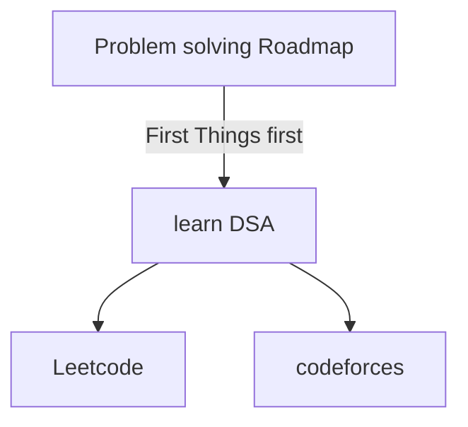

<details>
<summary>🌈 Click to reveal awesome table! 🚀</summary>

<table>
  <tr>
    <th colspan="3" style="background-color: #4CAF50; color: white; font-size: 16px; font-weight: bold; text-align: center; padding: 10px; border: 2px solid #4CAF50;">🌟 Super Awesome Table 🌟</th>
  </tr>
  <tr>
    <th style="background-color: #2196F3; color: white; padding: 10px; border: 1px solid #1976D2;">Header 1 📊</th>
    <th style="background-color: #FFC107; color: black; padding: 10px; border: 1px solid #FFA000;">Header 2 💡</th>
    <th style="background-color: #E91E63; color: white; padding: 10px; border: 1px solid #C2185B;">Header 3 🎨</th>
  </tr>
  <tr>
    <td style="background-color: #E3F2FD; padding: 10px; border: 1px solid #90CAF9;">
      <details>
        <summary>Expand for cool stuff!</summary>
        <ul>
          <li>Item 1 🔥</li>
          <li>Item 2 ⚡</li>
        </ul>
      </details>
    </td>
    <td style="background-color: #FFF9C4; padding: 10px; border: 1px solid #FFF176;">
      <br>
      GitHub Octocat!
    </td>
    <td style="background-color: #FCE4EC; padding: 10px; border: 1px solid #F48FB1;">
      <code>console.log("Hello!")</code>
    </td>
  </tr>
  <tr>
    <td style="background-color: #E8F5E9; padding: 10px; border: 1px solid #A5D6A7;">
      <a href="https://github.com">GitHub Link</a>
    </td>
    <td style="background-color: #FFECB3; padding: 10px; border: 1px solid #FFD54F;">
      <blockquote>Inspiring quote here!</blockquote>
    </td>
    <td style="background-color: #F3E5F5; padding: 10px; border: 1px solid #CE93D8;">
      <details>
        <summary>Task List</summary>
        <ul>
          <li>[ ] Task 1</li>
          <li>[x] Task 2</li>
        </ul>
      </details>
    </td>
  </tr>
</table>

</details>
# Project Name


## Project Overview
```
```

## Architecture


